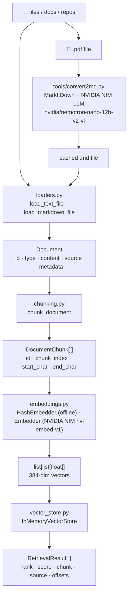

# Architecture

> NVADER v0.1.0 — current state as of Week 2 (knowledge layer complete).

## High-Level Overview

```
┌─────────────────────────────────────────────────────────┐
│                     CLI (nvader)                        │
│              typer + rich · cli.py                      │
├─────────────────────────────────────────────────────────┤
│                      Config                             │
│         pydantic models · config.py                     │
├──────────┬──────────┬──────────┬────────────────────────┤
│  agents/ │  tools/  │ memory/  │       core/            │
├──────────┴──────────┴──────────┤  documents, state,     │
│       ingestion/               │  tracing (planned)     │
│       retrieval/               ├────────────────────────┤
│       evaluation/              │       nvidia/          │
│       guardrails/              │  NIM, NeMo Guardrails  │
│       api/                     │  (planned)             │
├────────────────────────────────┴────────────────────────┤
│                    data/                                │
│        raw/ · processed/ · vector_store/ · traces/      │
└─────────────────────────────────────────────────────────┘
```

## Package Structure

```
src/nvidia_agentic_research_engineer/
├── __init__.py
├── cli.py              # Typer app — entry point (nvader)
├── config.py           # AppConfig + ProjectTOML (Pydantic)
├── agents/             # Agent definitions & orchestrator (planned)
├── api/                # REST / FastAPI surface (planned)
├── core/               # Domain models & cross-cutting concerns
│   └── documents.py    # Document + DocumentChunk models
├── evaluation/         # Eval harnesses, metrics, reports (planned)
├── guardrails/         # Input/output guardrails, NeMo adapter (planned)
├── ingestion/          # Document loaders, chunking, indexing
│   ├── loaders.py      # load_text_file, load_markdown_file, load_file
│   └── chunking.py     # chunk_text, chunk_document, chunk_documents
├── memory/             # Conversation & long-term memory stores (planned)
├── nvidia/             # NVIDIA platform integrations (NIM, etc.) (planned)
├── retrieval/          # Vector search & RAG retrieval logic
│   ├── models.py       # SearchResult, RetrievalQuery, RetrievalConfig
│   ├── embeddings.py   # EmbedderProtocol, HashEmbedder, Embedder, get_embedder
│   ├── vector_store.py # cosine_similarity, InMemoryVectorStore, RetrievalResult
│   └── pipeline.py     # supported_files, build_vector_store_from_path, search_path
└── tools/
    └── convert2md.py   # pdf_to_markdown — MarkItDown + NVIDIA NIM LLM OCR
```

## Implemented Components

### CLI (`cli.py`)

Entry point registered as `nvader` in `pyproject.toml`. Built with **Typer** + **Rich**.

| Command | Description |
|---|---|
| `nvader info` | Show project identity and configuration |
| `nvader roadmap` | Print the 8-week certification roadmap |
| `nvader search <path> <query>` | Index all supported files under `<path>` and return ranked results |

`nvader search` options:

| Flag | Default | Description |
|---|---|---|
| `--top-k` / `-k` | `5` | Number of results |
| `--chunk-size` | `500` | Characters per chunk |
| `--chunk-overlap` | `100` | Overlap between chunks |
| `--reconvert` | off | Force PDF re-conversion even if cached `.md` exists |

### Configuration (`config.py`)

Two Pydantic models:

- **`ProjectTOML`** — reads project metadata (name, version, authors) from `pyproject.toml` at import time.
- **`AppConfig`** — runtime settings: data directories, `default_top_k`, `require_citations`, `max_retries`.

### Core Models (`core/documents.py`)

- **`DocumentType`** — supported source types (`text`, `markdown`, `html`, `pdf`, `url`, `repo`, `paper`, `image`).
- **`Document`** — SHA-256 content-derived ID, UTC timestamp, typed metadata, `short_preview()` for display truncation.
- **`DocumentChunk`** — slice of a `Document` with stable `id`, `chunk_index`, character offsets (`start_char`, `end_char`), and inherited metadata.

### Ingestion (`ingestion/`)

- **`loaders.py`** — `load_text_file(path)` and `load_markdown_file(path)`: read files into typed `Document` objects.
- **`chunking.py`**:
  - `chunk_text(text, *, chunk_size, chunk_overlap)` — low-level splitter, returns `(text, start, end)` tuples.
  - `chunk_document(document, ...)` — converts a `Document` into a list of `DocumentChunk` instances, preserving source and metadata.
  - `chunk_documents(documents, ...)` — batch variant over a sequence of documents.

### Retrieval (`retrieval/`)

- **`models.py`**:
  - `SearchResult` — frozen Pydantic model: `chunk_id`, `document_id`, `text`, `score`, optional `source`/`metadata`.
  - `RetrievalQuery` — query string + `top_k` (1–100) + optional filters.
  - `RetrievalConfig` — embedding model, index name, `top_k`, similarity threshold, hybrid-search flag.

- **`embeddings.py`**:
  - `EmbedderProtocol` — `@runtime_checkable` Protocol; any class with `embed_texts` + `embed_query` satisfies it.
  - `HashEmbedder` — fully offline, 384-dim deterministic embedder using feature hashing (bag-of-words with SHA-256 hashing trick); texts sharing vocabulary yield high cosine similarity, stable across processes.
  - `Embedder` — **NVIDIA NIM** OpenAI-compatible endpoint wrapper (`nvidia/nv-embed-v1`); lazy-imports `openai` to stay testable without the package installed.
  - `get_embedder(model, api_key)` — factory: returns `Embedder` when `NVIDIA_API_KEY` is set, else `HashEmbedder`.

- **`vector_store.py`**:
  - `cosine_similarity(a, b)` — dependency-free cosine similarity helper; raises `ValueError` on mismatched lengths, returns `0.0` for zero-norm vectors.
  - `InMemoryVectorStore` — stores `(DocumentChunk, embedding)` pairs; `add_chunks()` embeds and indexes chunks; `search(query, top_k)` returns ranked `RetrievalResult` list.
  - `RetrievalResult` — frozen dataclass: `chunk`, `score`, `rank`; preserves source, offsets, chunk ID, and metadata for full attribution.

- **`pipeline.py`**:
  - `supported_files(path)` — discovers all `.txt`, `.md`, `.pdf` files from a file or directory (recursive).
  - `build_vector_store_from_path(path, *, chunk_size, chunk_overlap, embedder, store, reconvert)` — loads, chunks, embeds, and indexes all supported files. PDFs are converted to Markdown via `convert2md.pdf_to_markdown()` and cached; `reconvert=True` forces re-conversion.
  - `search_path(path, query, top_k, chunk_size, chunk_overlap, reconvert)` — end-to-end convenience function: indexes a path then returns ranked `RetrievalResult` list.

### PDF Processing (`tools/convert2md.py`)

- Converts PDF files to Markdown using [MarkItDown](https://github.com/microsoft/markitdown) (`markitdown[pdf]` + optional `markitdown-ocr` plugin).
- Uses the NVIDIA NIM LLM client (`nvidia/nemotron-nano-12b-v2-vl`) for LLM-assisted image description and OCR.
- The resulting `.md` is written next to the source PDF and **reused** on subsequent runs unless `--reconvert` is passed.

## Planned Modules (Stubbed)

All modules below exist as empty packages, mapped to NVIDIA certification domains.

| Module         | Purpose                                        | Certification Domain       |
|----------------|------------------------------------------------|----------------------------|
| `agents/`      | Base agent, ReAct loop, orchestrator           | Agent Architecture & Dev   |
| `tools/`       | Tool registry, built-in tools                  | Agent Architecture & Dev   |
| `memory/`      | Conversation buffer, long-term memory          | Cognition & Memory         |
| `evaluation/`  | Eval harnesses, metrics, report generation     | Evaluation                 |
| `guardrails/`  | Input/output validation, NeMo Guardrails       | Safety & Ethics            |
| `nvidia/`      | NIM endpoints, NeMo platform integration       | NVIDIA Platform            |
| `api/`         | REST API surface for the agent                 | Deployment                 |

## Ingestion, Embedding, and Retrieval Pipeline

Current flow:

1. Discover supported files (`.txt`, `.md`, `.pdf`) from a path via `supported_files()`.
2. **PDF files** are converted to Markdown by MarkItDown + NVIDIA NIM LLM and the result cached as `<stem>.md`.
3. Load files into typed `Document` objects (SHA-256 ID, UTC timestamp).
4. Split documents into `DocumentChunk` objects with character offsets.
5. Preserve source, metadata, and stable IDs for downstream retrieval.
6. Chunks are embedded via `HashEmbedder` (offline, feature hashing) or `Embedder` (NVIDIA NIM `nv-embed-v1`).
7. Embedded chunks are indexed in `InMemoryVectorStore`.
8. Queries are embedded and ranked by cosine similarity, returning top-k `RetrievalResult` objects with full source attribution.

```text
file -> (PDF→MD conversion) -> Document -> DocumentChunk -> embedding -> vector store -> top-k RetrievalResult
```



## Data Layout

```
data/
├── raw/            # Original ingested documents
├── processed/      # Chunked / transformed documents
├── vector_store/   # Embedding index (e.g. FAISS, Milvus)
└── traces/         # Agent execution traces for observability
```

## Dependencies

| Package        | Role                                     |
|----------------|------------------------------------------|
| `typer ≥0.12`  | CLI framework                            |
| `pydantic ≥2.7`| Config & domain model validation         |
| `rich ≥13.7`   | Terminal formatting & panels             |
| `python-dotenv`| `.env` file loading                      |
| `toml`         | `pyproject.toml` parsing                 |
| `openai`       | NVIDIA NIM embedding + LLM APIs          |
| `markitdown[pdf]` | PDF → Markdown conversion             |
| `markitdown-ocr` | LLM-based OCR plugin for MarkItDown (optional) |

Dev: `pytest ≥8.0`, `ruff ≥0.5`.

## Test Coverage

| Test file                      | Covers                                         | Tests |
|-------------------------------|------------------------------------------------|-------|
| `test_documents.py`           | `Document`, `DocumentType`, `short_preview`    | —     |
| `test_ingestion_loaders.py`   | `load_text_file`, `load_markdown_file`         | —     |
| `test_chunking.py`            | `chunk_text`, `chunk_document`, `chunk_documents` | —  |
| `test_retrieval_embeddings.py`| `HashEmbedder`, `Embedder`, `EmbedderProtocol`, `SearchResult`, `RetrievalQuery`, `RetrievalConfig` | 45 |
| `test_retrieval_vector_store.py` | `cosine_similarity`, `InMemoryVectorStore`, `RetrievalResult` | 15 |
| `test_retrieval_pipeline.py`  | `supported_files`, `build_vector_store_from_path` (PDF caching, `--reconvert`), `search_path` relevance | 24 |
| `test_cli.py`                 | `nvader info`, `nvader roadmap`, `nvader search` | 3   |

## Build Roadmap Alignment

The architecture is being built incrementally over 8 weeks:

1. **Week 1** — Foundation & architecture skeleton ← *done*
2. **Week 2** — RAG & knowledge integration (`ingestion/`, `retrieval/`) ← *done*
3. **Week 3** — ReAct agent & tool orchestration (`agents/`, `tools/`) ← *up next*
4. **Week 4** — Planning & memory (`memory/`, `core/state.py`)
5. **Week 5** — Multi-agent workflows (`agents/orchestrator.py`)
6. **Week 6** — Evaluation & tuning (`evaluation/`, `evals/`)
7. **Week 7** — NVIDIA platform & deployment (`nvidia/`, `api/`)
8. **Week 8** — Monitoring, safety, HITL, final exam prep (`guardrails/`, tracing)
